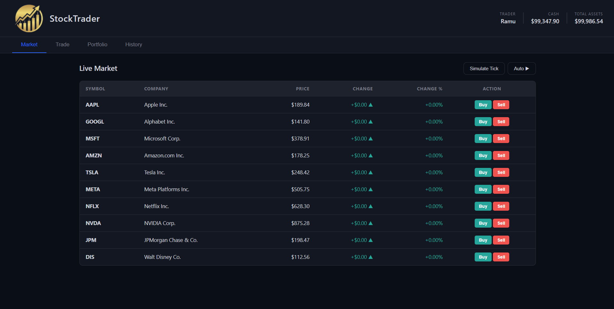
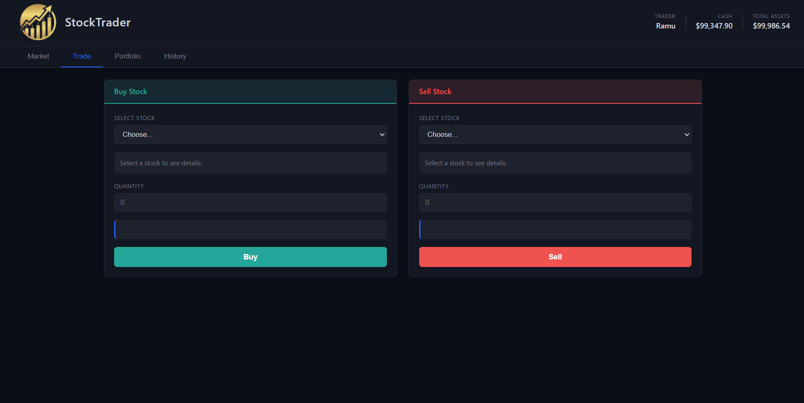
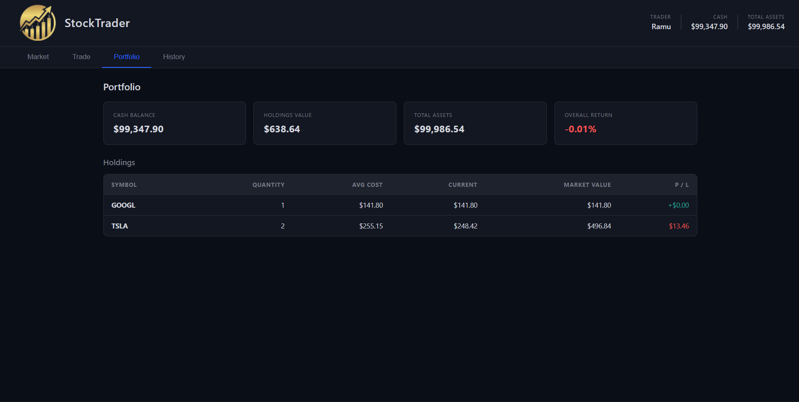
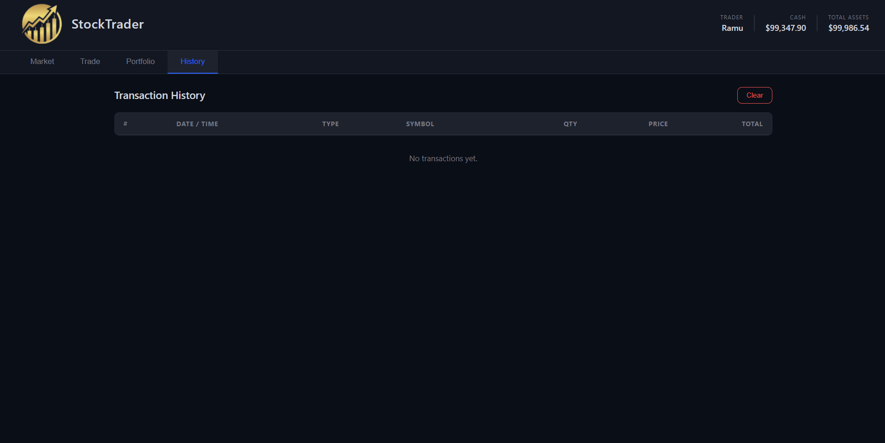

# 📈 StockTrader – Virtual Stock Trading Platform

A simple and interactive **virtual stock trading platform** built for learning and demonstrating stock market concepts, portfolio management, and Object-Oriented Programming.

## 🚀 Features

- 💰 Virtual starting balance of **$100,000**
- 📊 Simulated stock market with multiple stocks
- 📈 Automatic stock price updates
- 🛒 Buy and sell stocks
- 💼 Portfolio management
- 💵 Average purchase price calculation
- 📊 Profit/Loss tracking
- 🧾 Transaction history
- 💾 Data persistence using LocalStorage
- 📱 Responsive and user-friendly interface

## 🛠️ Technologies Used

### Frontend
- HTML5
- CSS3
- JavaScript
- LocalStorage

### Backend / Java
- Java
- Object-Oriented Programming
- ArrayList / Collections

## 📂 Project Structure

```text
StockTradingPlatform/
│
├── index.html
├── style.css
├── app.js
├── logo.png
├── Stock.java
├── StockMarket.java
├── Stock.class
└── StockMarket.class
```

## 📊 Available Stocks

The platform includes simulated stocks such as:

| Symbol | Company |
|--------|---------|
| AAPL | Apple |
| GOOGL | Alphabet |
| MSFT | Microsoft |
| AMZN | Amazon |
| TSLA | Tesla |
| META | Meta |
| NFLX | Netflix |
| NVDA | NVIDIA |
| JPM | JPMorgan Chase |
| DIS | Disney |

> **Note:** Stock prices are simulated and are not real-time market prices.

## ⚙️ How It Works

1. Start with **$100,000 virtual cash**.
2. Select a stock from the market.
3. Enter the quantity you want to purchase.
4. Buy or sell stocks.
5. Monitor your portfolio value and profit/loss.
6. Stock prices automatically change during the simulation.

## 🧠 Concepts Demonstrated

- Object-Oriented Programming
- Classes and Objects
- Encapsulation
- Collections
- ArrayList
- Event Handling
- DOM Manipulation
- LocalStorage
- Basic financial calculations

## ▶️ How to Run

### Frontend

Simply open:

```text
index.html
```

in a modern web browser.

### Java

Compile:

```bash
javac Stock.java StockMarket.java
```

Run the required Java class:

```bash
java StockMarket
```

## 📸 Screeshots

_Add your project screenshots here._

#Dashboard


#Trade Page


#Portfolio Page


#History Page



## 🔮 Future Enhancements

- Real-time stock market API
- User authentication
- Database integration
- Stock charts
- Watchlist
- Advanced portfolio analytics
- Order history and reports
- Cloud deployment

## 👨‍💻 Author

**Chidananda P**  
Computer Science & Engineering Student

## 📌 Disclaimer

This project is created for **educational purposes only**. All stock prices and trading activities are simulated and do not represent real financial transactions.

## 📄 License

This project is intended for educational and academic use.
